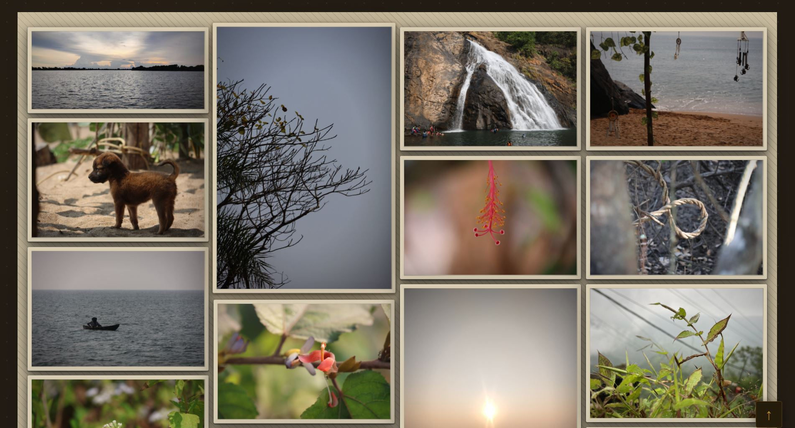

# 🍂 Nature's Canvas  
> A dark vintage, single file photo gallery - built by **Prasad**
## Preview
  **https://laxdip.github.io/**
## Screenshots
<div align="center">
  <span style="display: block; line-height: 0; margin: 0; padding: 0;">
    
  </span>
  <span style="display: block; line-height: 0; margin: 0; padding: 0;">
    
  </span>
</div>
---

## Features

- **GitHub Pages ready** — auto-reads `images/manifest.json`, zero config needed
- **Dark vintage aesthetic** — deep charcoal + amber gold palette, grain texture, ambient glow
- **Masonry grid** — 4 → 3 → 2 → 1 columns, Pinterest-style
- **Lightbox** — keyboard nav (← →), swipe on mobile, zoom, download button
- **Smooth animations** — IntersectionObserver staggered reveal, GPU-accelerated
- **Compact view toggle** — switch between normal and tight grid
- **Scroll-to-top button** — appears after scrolling 380px
- **Zero dependencies** — pure vanilla HTML/CSS/JS, works offline

---

## Project Structure

```
your-repo/
├── index.html
├── README.md
└── images/
    ├── manifest.json   ← YOU CREATE THIS (see below)
    ├── forest.jpg
    ├── river.webp
    └── ...
```

---

## Setup for GitHub Pages

### Step 1 — Add your photos to `images/`

### Step 2 — Create `images/manifest.json`

This is the key file that makes GitHub Pages work. Create it manually:

```json
["forest.jpg", "river.webp", "mountain.png", "sunset.jpg"]
```

Just an array of your image filenames. That's it.

### Step 3 — Push and enable Pages

```bash
git add .
git commit -m "add gallery photos"
git push
```

Then go to **GitHub → Settings → Pages → Source → main branch → / (root)** → Save.

Your site will be live at `https://your-username.github.io/repo-name/`

> **Every time you add a new photo:** add the filename to `manifest.json` and push.

---

## Running Locally

Double-clicking `index.html` won't work (browser security blocks folder access).  
Use a local server instead:

```bash
# Python 3
python -m http.server 8080
# → visit http://localhost:8080
```

```bash
# Node.js
npx serve .
```

Locally, `manifest.json` is optional — the site auto-scans the `images/` folder.

---

## Keyboard Shortcuts

| Key | Action |
|-----|--------|
| `←` / `→` | Navigate photos in lightbox |
| `Esc` | Close lightbox |
| `Enter` / `Space` | Open focused photo |

---

## Responsive Breakpoints

| Screen | Columns |
|--------|---------|
| > 1200px | 4 |
| 761–1200px | 3 |
| 441–760px | 2 |
| ≤ 440px | 1 |

---

## Customisation

All colors are CSS variables at the top of `index.html`:

```css
:root {
  --bg-deep:      #0d0a05;   /* page background */
  --amber-gold:   #c9922a;   /* main accent */
  --amber-bright: #e8b84b;   /* title glow */
  --cream:        #e2d4bc;   /* body text */
  --mat-outer:    #221808;   /* photo frame */
}
```

---

## License

MIT — free to use, modify, and share.

---

*"In every walk with nature, one receives far more than he seeks :) " — John Muir*
